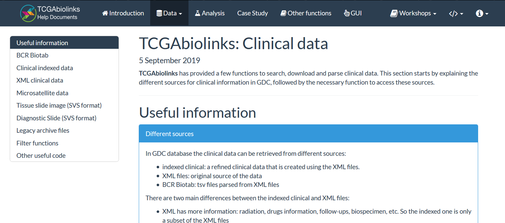

```{r setup, include=FALSE}
knitr::opts_chunk$set(echo = FALSE)

library(HPAanalyze)
```

## The Why of this package

- The Human Protein Atlas (HPA) maps human proteins via multiple technologies.

- Beautiful web portal, but certain aspects of data retrieval and analysis left something to be desired.

---

## The real Why of this package

- I had just learned R (in 2017).

- My PhD mentor was overly excited to see some EDA I did with HPA data and suggested that I wrote a software package.

---
## The real Why of this package

- I had just learned R (in 2017).

- My PhD mentor was overly excited to see some EDA I did with HPA data and suggested that I wrote a software package.

- ... she meant an iPhone app.

- I wrote this package to learn how R worked.

---

## Installation

```{r cars, echo = TRUE, eval=FALSE}
devtools::install_github("trannhatanh89/HPAanalyze")
```

---

```{r }

```

---
## Demo

Almost everything is documented in vignettes

```{r echo = TRUE, eval = FALSE}
browseVignettes("HPAanalyze")
```

---
## I need some help

- Package testing.

- Reducing dependencies.

- Improving documentation.

---
## Testing

- Package is continuously tested with Travis-CI.

- Do I need testthat?

- How to test a functions whose output is a plot?

---
## Reducing dependencies

- Currently dependent on 60 packages (Bioconductor estimate).

- Imports: dplyr, openxlsx, ggplot2, readr, tibble, xml2, tidyr, stats, utils, hpar, gridExtra

- Should I be worried?

---
## Improving documentation

- Are my vignettes clear enough?

- How do I link my vignettes into a website like this?

```{r }

```
